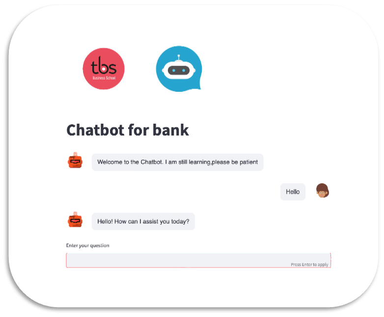

# 🤖 Banking Chatbot with Streamlit

This project is an interactive **banking chatbot** built with `Streamlit`, trained on a collection of frequently asked banking questions. It uses NLP preprocessing, Bag-of-Words vectorization, and a neural network classifier to understand user queries and provide appropriate responses.

---

## 📌 Features

- 🏦 Domain: Banking FAQ automation
- 💬 Real-time chatbot interface using Streamlit
- 🧠 Intent classification using `MLPClassifier`
- ✨ NLP preprocessing (tokenization, lemmatization, stopwords removal)
- 📚 Trained on a combination of two FAQ datasets

---

## 🚀 Demo

> Welcome message:
> > *"Welcome to the Chatbot. I am still learning, please be patient."*

> Example interaction:
> - User: *"How can I open an account?"*
> - Bot: *"You can open a savings account online via our website..."*

---

📄 License

This project is intended for portfolio demonstration purposes only.
